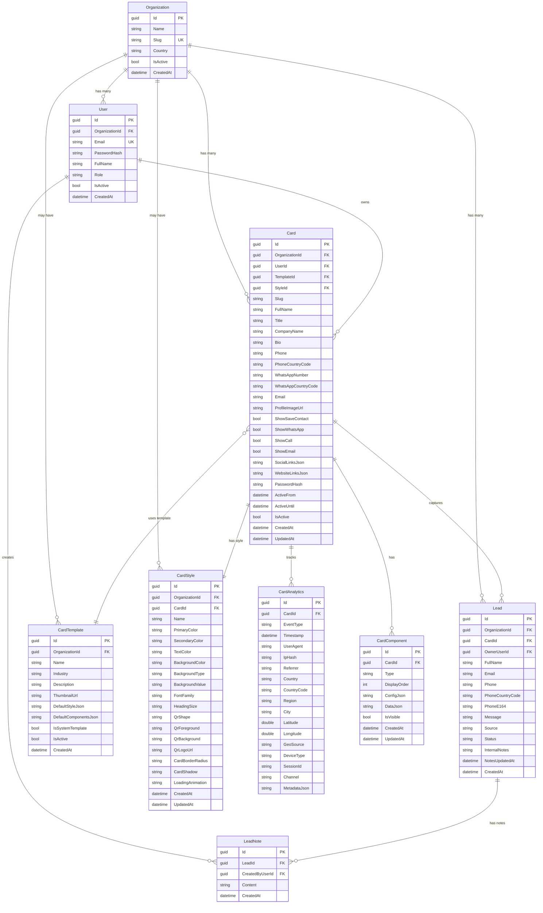

# 🗄️ DataTouch - Esquema de Base de Datos

## Tabla de Contenidos

1. [Diagrama ER](#diagrama-er)
2. [Descripción de Entidades](#descripción-de-entidades)
3. [Scripts SQL para MySQL](#scripts-sql-para-mysql)
4. [Datos de Prueba (Seed)](#datos-de-prueba-seed)
5. [Índices y Performance](#índices-y-performance)

---

## Diagrama ER



---

## Descripción de Entidades

### Organization (Organizaciones)

Representa una empresa o cuenta cliente en el sistema multi-tenant.

| Campo | Tipo | Restricciones | Descripción |
|-------|------|--------------|-------------|
| `Id` | GUID | PK | Identificador único |
| `Name` | VARCHAR(200) | NOT NULL | Nombre de la organización |
| `Slug` | VARCHAR(100) | NOT NULL, UNIQUE | URL-friendly identifier |
| `Country` | VARCHAR(100) | NULL | País de la organización |
| `IsActive` | BOOLEAN | DEFAULT true | Estado activo/inactivo |
| `CreatedAt` | DATETIME | NOT NULL | Fecha de creación |

---

### User (Usuarios)

Usuarios del sistema, asociados a una organización.

| Campo | Tipo | Restricciones | Descripción |
|-------|------|--------------|-------------|
| `Id` | GUID | PK | Identificador único |
| `OrganizationId` | GUID | FK, NOT NULL | Organización padre |
| `Email` | VARCHAR(255) | NOT NULL, UNIQUE por org | Email del usuario |
| `PasswordHash` | VARCHAR(500) | NOT NULL | Hash SHA256 de contraseña |
| `FullName` | VARCHAR(200) | NOT NULL | Nombre completo |
| `Role` | VARCHAR(50) | NOT NULL | Rol: "OrgAdmin", "OrgUser" |
| `IsActive` | BOOLEAN | DEFAULT true | Estado activo/inactivo |
| `CreatedAt` | DATETIME | NOT NULL | Fecha de creación |

---

### Card (Tarjetas Digitales)

Tarjeta digital NFC/QR con información de contacto.

| Campo | Tipo | Restricciones | Descripción |
|-------|------|--------------|-------------|
| `Id` | GUID | PK | Identificador único |
| `OrganizationId` | GUID | FK, NOT NULL | Organización propietaria |
| `UserId` | GUID | FK, NOT NULL | Usuario propietario |
| `TemplateId` | GUID | FK, NULL | Plantilla base (opcional) |
| `StyleId` | GUID | FK, NULL | Estilo personalizado |
| `Slug` | VARCHAR(100) | NOT NULL, UNIQUE por org | URL-friendly identifier |
| `FullName` | VARCHAR(200) | NOT NULL | Nombre en la tarjeta |
| `Title` | VARCHAR(150) | NULL | Cargo/título profesional |
| `CompanyName` | VARCHAR(200) | NULL | Nombre de empresa |
| `Bio` | VARCHAR(1000) | NULL | Biografía/descripción |
| `Phone` | VARCHAR(20) | NULL | Número de teléfono |
| `PhoneCountryCode` | VARCHAR(10) | NULL | Código de país (+503) |
| `WhatsAppNumber` | VARCHAR(20) | NULL | Número de WhatsApp |
| `WhatsAppCountryCode` | VARCHAR(10) | NULL | Código de país WhatsApp |
| `Email` | VARCHAR(255) | NULL | Email de contacto |
| `ProfileImageUrl` | VARCHAR(500) | NULL | URL de foto de perfil |
| `ShowSaveContact` | BOOLEAN | DEFAULT true | Mostrar botón guardar contacto |
| `ShowWhatsApp` | BOOLEAN | DEFAULT true | Mostrar botón WhatsApp |
| `ShowCall` | BOOLEAN | DEFAULT true | Mostrar botón llamar |
| `ShowEmail` | BOOLEAN | DEFAULT true | Mostrar botón email |
| `SocialLinksJson` | JSON | NULL | Redes sociales |
| `WebsiteLinksJson` | JSON | NULL | Enlaces web personalizados |
| `PasswordHash` | VARCHAR(500) | NULL | Protección opcional |
| `ActiveFrom` | DATETIME | NULL | Fecha de activación |
| `ActiveUntil` | DATETIME | NULL | Fecha de expiración |
| `IsActive` | BOOLEAN | DEFAULT true | Estado activo/inactivo |
| `CreatedAt` | DATETIME | NOT NULL | Fecha de creación |
| `UpdatedAt` | DATETIME | NULL | Última actualización |

**Formato de SocialLinksJson:**
```json
{
  "linkedin": "https://linkedin.com/in/usuario",
  "instagram": "https://instagram.com/usuario",
  "twitter": "https://twitter.com/usuario",
  "facebook": "https://facebook.com/usuario",
  "tiktok": "https://tiktok.com/@usuario"
}
```

**Formato de WebsiteLinksJson:**
```json
[
  {"title": "Nuestros Servicios", "url": "https://example.com/services"},
  {"title": "Agendar Consulta", "url": "https://calendly.com/user"}
]
```

---

### Lead (Leads/Prospectos)

Leads capturados desde formularios de tarjetas públicas.

| Campo | Tipo | Restricciones | Descripción |
|-------|------|--------------|-------------|
| `Id` | GUID | PK | Identificador único |
| `OrganizationId` | GUID | FK, NOT NULL | Organización |
| `CardId` | GUID | FK, NOT NULL | Tarjeta origen |
| `OwnerUserId` | GUID | FK, NOT NULL | Usuario responsable |
| `FullName` | VARCHAR(200) | NOT NULL | Nombre del lead |
| `Email` | VARCHAR(255) | NOT NULL | Email del lead |
| `Phone` | VARCHAR(50) | NULL | Teléfono |
| `PhoneCountryCode` | VARCHAR(10) | NULL | Código de país |
| `PhoneE164` | VARCHAR(20) | NULL | Formato E.164 |
| `Message` | VARCHAR(2000) | NULL | Mensaje del formulario |
| `Source` | VARCHAR(50) | NOT NULL | Fuente: "CARD_CONTACT_FORM" |
| `Status` | VARCHAR(50) | NOT NULL | "New", "Contacted", "Qualified", "Closed" |
| `InternalNotes` | VARCHAR(2000) | NULL | Notas internas |
| `NotesUpdatedAt` | DATETIME | NULL | Última actualización de notas |
| `CreatedAt` | DATETIME | NOT NULL | Fecha de captura |

---

### CardAnalytics (Eventos de Analytics)

Registra todas las interacciones con las tarjetas.

| Campo | Tipo | Restricciones | Descripción |
|-------|------|--------------|-------------|
| `Id` | GUID | PK | Identificador único |
| `CardId` | GUID | FK, NOT NULL | Tarjeta relacionada |
| `EventType` | VARCHAR(50) | NOT NULL | Tipo de evento |
| `Timestamp` | DATETIME | NOT NULL | Momento del evento (UTC) |
| `UserAgent` | VARCHAR(500) | NULL | User-Agent del visitante |
| `IpHash` | VARCHAR(50) | NULL | Hash SHA256 de IP |
| `Referrer` | VARCHAR(500) | NULL | Dominio de origen |
| `Country` | VARCHAR(100) | NULL | País (nombre completo) |
| `CountryCode` | VARCHAR(10) | NULL | Código ISO (SV, US, MX) |
| `Region` | VARCHAR(100) | NULL | Región/Estado |
| `City` | VARCHAR(100) | NULL | Ciudad |
| `Latitude` | DOUBLE | NULL | Latitud (para mapas) |
| `Longitude` | DOUBLE | NULL | Longitud (para mapas) |
| `GeoSource` | VARCHAR(20) | NULL | Fuente: "ip", "gps", "lookup" |
| `DeviceType` | VARCHAR(20) | NULL | "mobile", "tablet", "desktop" |
| `SessionId` | VARCHAR(50) | NULL | ID de sesión anónimo |
| `Channel` | VARCHAR(50) | NULL | Canal de interacción |
| `MetadataJson` | JSON | NULL | Datos adicionales |

**Tipos de EventType:**
- `page_view` - Vista de la página
- `qr_scan` - Escaneo del código QR
- `nfc_tap` - Tap de NFC
- `cta_click` - Clic en botón de acción
- `link_click` - Clic en enlace/red social
- `contact_save` - Descarga de vCard
- `form_submit` - Envío de formulario
- `share` - Tarjeta compartida

---

## Scripts SQL para MySQL

### Crear Base de Datos

```sql
-- ═══════════════════════════════════════════════════════════════════════════════
-- DataTouch - Script de Creación de Base de Datos
-- Motor: MySQL 8.x
-- ═══════════════════════════════════════════════════════════════════════════════

CREATE DATABASE IF NOT EXISTS datatouch
CHARACTER SET utf8mb4
COLLATE utf8mb4_unicode_ci;

USE datatouch;

-- ═══════════════════════════════════════════════════════════════════════════════
-- TABLA: Organizations
-- ═══════════════════════════════════════════════════════════════════════════════

CREATE TABLE Organizations (
    Id CHAR(36) NOT NULL PRIMARY KEY,
    Name VARCHAR(200) NOT NULL,
    Slug VARCHAR(100) NOT NULL,
    Country VARCHAR(100) NULL,
    IsActive BOOLEAN NOT NULL DEFAULT TRUE,
    CreatedAt DATETIME NOT NULL DEFAULT CURRENT_TIMESTAMP,
    
    UNIQUE INDEX IX_Organizations_Slug (Slug)
) ENGINE=InnoDB;

-- ═══════════════════════════════════════════════════════════════════════════════
-- TABLA: Users
-- ═══════════════════════════════════════════════════════════════════════════════

CREATE TABLE Users (
    Id CHAR(36) NOT NULL PRIMARY KEY,
    OrganizationId CHAR(36) NOT NULL,
    Email VARCHAR(255) NOT NULL,
    PasswordHash VARCHAR(500) NOT NULL,
    FullName VARCHAR(200) NOT NULL,
    Role VARCHAR(50) NOT NULL DEFAULT 'OrgUser',
    IsActive BOOLEAN NOT NULL DEFAULT TRUE,
    CreatedAt DATETIME NOT NULL DEFAULT CURRENT_TIMESTAMP,
    
    UNIQUE INDEX IX_Users_OrgId_Email (OrganizationId, Email),
    
    CONSTRAINT FK_Users_Organizations 
        FOREIGN KEY (OrganizationId) 
        REFERENCES Organizations(Id) 
        ON DELETE CASCADE
) ENGINE=InnoDB;

-- ═══════════════════════════════════════════════════════════════════════════════
-- TABLA: CardTemplates
-- ═══════════════════════════════════════════════════════════════════════════════

CREATE TABLE CardTemplates (
    Id CHAR(36) NOT NULL PRIMARY KEY,
    OrganizationId CHAR(36) NULL,
    Name VARCHAR(100) NOT NULL,
    Industry VARCHAR(50) NOT NULL,
    Description VARCHAR(500) NULL,
    ThumbnailUrl VARCHAR(500) NOT NULL,
    DefaultStyleJson JSON NULL,
    DefaultComponentsJson JSON NULL,
    IsSystemTemplate BOOLEAN NOT NULL DEFAULT TRUE,
    IsActive BOOLEAN NOT NULL DEFAULT TRUE,
    CreatedAt DATETIME NOT NULL DEFAULT CURRENT_TIMESTAMP,
    
    INDEX IX_CardTemplates_Industry (Industry),
    INDEX IX_CardTemplates_IsSystem (IsSystemTemplate),
    
    CONSTRAINT FK_CardTemplates_Organizations 
        FOREIGN KEY (OrganizationId) 
        REFERENCES Organizations(Id) 
        ON DELETE CASCADE
) ENGINE=InnoDB;

-- ═══════════════════════════════════════════════════════════════════════════════
-- TABLA: Cards
-- ═══════════════════════════════════════════════════════════════════════════════

CREATE TABLE Cards (
    Id CHAR(36) NOT NULL PRIMARY KEY,
    OrganizationId CHAR(36) NOT NULL,
    UserId CHAR(36) NOT NULL,
    TemplateId CHAR(36) NULL,
    StyleId CHAR(36) NULL,
    Slug VARCHAR(100) NOT NULL,
    FullName VARCHAR(200) NOT NULL,
    Title VARCHAR(150) NULL,
    CompanyName VARCHAR(200) NULL,
    Bio VARCHAR(1000) NULL,
    Phone VARCHAR(20) NULL,
    PhoneCountryCode VARCHAR(10) NULL,
    WhatsAppNumber VARCHAR(20) NULL,
    WhatsAppCountryCode VARCHAR(10) NULL,
    Email VARCHAR(255) NULL,
    ProfileImageUrl VARCHAR(500) NULL,
    ShowSaveContact BOOLEAN NOT NULL DEFAULT TRUE,
    ShowWhatsApp BOOLEAN NOT NULL DEFAULT TRUE,
    ShowCall BOOLEAN NOT NULL DEFAULT TRUE,
    ShowEmail BOOLEAN NOT NULL DEFAULT TRUE,
    SocialLinksJson JSON NULL,
    WebsiteLinksJson JSON NULL,
    PasswordHash VARCHAR(500) NULL,
    ActiveFrom DATETIME NULL,
    ActiveUntil DATETIME NULL,
    IsActive BOOLEAN NOT NULL DEFAULT TRUE,
    CreatedAt DATETIME NOT NULL DEFAULT CURRENT_TIMESTAMP,
    UpdatedAt DATETIME NULL ON UPDATE CURRENT_TIMESTAMP,
    
    UNIQUE INDEX IX_Cards_OrgId_Slug (OrganizationId, Slug),
    INDEX IX_Cards_OrgId (OrganizationId),
    
    CONSTRAINT FK_Cards_Organizations 
        FOREIGN KEY (OrganizationId) 
        REFERENCES Organizations(Id) 
        ON DELETE CASCADE,
    CONSTRAINT FK_Cards_Users 
        FOREIGN KEY (UserId) 
        REFERENCES Users(Id) 
        ON DELETE RESTRICT,
    CONSTRAINT FK_Cards_Templates 
        FOREIGN KEY (TemplateId) 
        REFERENCES CardTemplates(Id) 
        ON DELETE SET NULL
) ENGINE=InnoDB;

-- ═══════════════════════════════════════════════════════════════════════════════
-- TABLA: CardStyles
-- ═══════════════════════════════════════════════════════════════════════════════

CREATE TABLE CardStyles (
    Id CHAR(36) NOT NULL PRIMARY KEY,
    OrganizationId CHAR(36) NULL,
    CardId CHAR(36) NULL,
    Name VARCHAR(100) NOT NULL DEFAULT 'Custom',
    PrimaryColor VARCHAR(20) NOT NULL DEFAULT '#6366F1',
    SecondaryColor VARCHAR(20) NOT NULL DEFAULT '#EC4899',
    TextColor VARCHAR(20) NOT NULL DEFAULT '#1F2937',
    BackgroundColor VARCHAR(20) NOT NULL DEFAULT '#FFFFFF',
    BackgroundType VARCHAR(20) NOT NULL DEFAULT 'gradient',
    BackgroundValue VARCHAR(1000) NULL,
    FontFamily VARCHAR(100) NOT NULL DEFAULT 'Inter',
    HeadingSize VARCHAR(20) NOT NULL DEFAULT '1.5rem',
    QrShape VARCHAR(20) NOT NULL DEFAULT 'square',
    QrForeground VARCHAR(20) NOT NULL DEFAULT '#000000',
    QrBackground VARCHAR(20) NOT NULL DEFAULT '#FFFFFF',
    QrLogoUrl VARCHAR(500) NULL,
    CardBorderRadius VARCHAR(20) NOT NULL DEFAULT '16px',
    CardShadow VARCHAR(200) NOT NULL DEFAULT '0 4px 20px rgba(0,0,0,0.1)',
    LoadingAnimation VARCHAR(20) NOT NULL DEFAULT 'fade',
    CreatedAt DATETIME NOT NULL DEFAULT CURRENT_TIMESTAMP,
    UpdatedAt DATETIME NULL ON UPDATE CURRENT_TIMESTAMP,
    
    CONSTRAINT FK_CardStyles_Organizations 
        FOREIGN KEY (OrganizationId) 
        REFERENCES Organizations(Id) 
        ON DELETE CASCADE,
    CONSTRAINT FK_CardStyles_Cards 
        FOREIGN KEY (CardId) 
        REFERENCES Cards(Id) 
        ON DELETE CASCADE
) ENGINE=InnoDB;

-- Agregar FK de StyleId a Cards después de crear CardStyles
ALTER TABLE Cards 
ADD CONSTRAINT FK_Cards_Styles 
    FOREIGN KEY (StyleId) 
    REFERENCES CardStyles(Id) 
    ON DELETE SET NULL;

-- ═══════════════════════════════════════════════════════════════════════════════
-- TABLA: CardComponents
-- ═══════════════════════════════════════════════════════════════════════════════

CREATE TABLE CardComponents (
    Id CHAR(36) NOT NULL PRIMARY KEY,
    CardId CHAR(36) NOT NULL,
    Type VARCHAR(50) NOT NULL,
    DisplayOrder INT NOT NULL DEFAULT 0,
    ConfigJson JSON NULL,
    DataJson JSON NULL,
    IsVisible BOOLEAN NOT NULL DEFAULT TRUE,
    CreatedAt DATETIME NOT NULL DEFAULT CURRENT_TIMESTAMP,
    UpdatedAt DATETIME NULL ON UPDATE CURRENT_TIMESTAMP,
    
    INDEX IX_CardComponents_CardId (CardId),
    INDEX IX_CardComponents_CardId_Order (CardId, DisplayOrder),
    
    CONSTRAINT FK_CardComponents_Cards 
        FOREIGN KEY (CardId) 
        REFERENCES Cards(Id) 
        ON DELETE CASCADE
) ENGINE=InnoDB;

-- ═══════════════════════════════════════════════════════════════════════════════
-- TABLA: Leads
-- ═══════════════════════════════════════════════════════════════════════════════

CREATE TABLE Leads (
    Id CHAR(36) NOT NULL PRIMARY KEY,
    OrganizationId CHAR(36) NOT NULL,
    CardId CHAR(36) NOT NULL,
    OwnerUserId CHAR(36) NOT NULL,
    FullName VARCHAR(200) NOT NULL,
    Email VARCHAR(255) NOT NULL,
    Phone VARCHAR(50) NULL,
    PhoneCountryCode VARCHAR(10) NULL,
    PhoneE164 VARCHAR(20) NULL,
    Message VARCHAR(2000) NULL,
    Source VARCHAR(50) NOT NULL DEFAULT 'CARD_CONTACT_FORM',
    Status VARCHAR(50) NOT NULL DEFAULT 'New',
    InternalNotes VARCHAR(2000) NULL,
    NotesUpdatedAt DATETIME NULL,
    CreatedAt DATETIME NOT NULL DEFAULT CURRENT_TIMESTAMP,
    
    INDEX IX_Leads_OrgId (OrganizationId),
    INDEX IX_Leads_CreatedAt (CreatedAt),
    INDEX IX_Leads_Status (Status),
    
    CONSTRAINT FK_Leads_Organizations 
        FOREIGN KEY (OrganizationId) 
        REFERENCES Organizations(Id) 
        ON DELETE CASCADE,
    CONSTRAINT FK_Leads_Cards 
        FOREIGN KEY (CardId) 
        REFERENCES Cards(Id) 
        ON DELETE RESTRICT,
    CONSTRAINT FK_Leads_Users 
        FOREIGN KEY (OwnerUserId) 
        REFERENCES Users(Id) 
        ON DELETE RESTRICT
) ENGINE=InnoDB;

-- ═══════════════════════════════════════════════════════════════════════════════
-- TABLA: LeadNotes
-- ═══════════════════════════════════════════════════════════════════════════════

CREATE TABLE LeadNotes (
    Id CHAR(36) NOT NULL PRIMARY KEY,
    LeadId CHAR(36) NOT NULL,
    CreatedByUserId CHAR(36) NOT NULL,
    Content VARCHAR(2000) NOT NULL,
    CreatedAt DATETIME NOT NULL DEFAULT CURRENT_TIMESTAMP,
    
    INDEX IX_LeadNotes_LeadId (LeadId),
    INDEX IX_LeadNotes_CreatedAt (CreatedAt),
    
    CONSTRAINT FK_LeadNotes_Leads 
        FOREIGN KEY (LeadId) 
        REFERENCES Leads(Id) 
        ON DELETE CASCADE,
    CONSTRAINT FK_LeadNotes_Users 
        FOREIGN KEY (CreatedByUserId) 
        REFERENCES Users(Id) 
        ON DELETE RESTRICT
) ENGINE=InnoDB;

-- ═══════════════════════════════════════════════════════════════════════════════
-- TABLA: CardAnalytics
-- ═══════════════════════════════════════════════════════════════════════════════

CREATE TABLE CardAnalytics (
    Id CHAR(36) NOT NULL PRIMARY KEY,
    CardId CHAR(36) NOT NULL,
    EventType VARCHAR(50) NOT NULL,
    Timestamp DATETIME NOT NULL DEFAULT CURRENT_TIMESTAMP,
    UserAgent VARCHAR(500) NULL,
    IpHash VARCHAR(50) NULL,
    Referrer VARCHAR(500) NULL,
    Country VARCHAR(100) NULL,
    CountryCode VARCHAR(10) NULL,
    Region VARCHAR(100) NULL,
    City VARCHAR(100) NULL,
    Latitude DOUBLE NULL,
    Longitude DOUBLE NULL,
    GeoSource VARCHAR(20) NULL,
    DeviceType VARCHAR(20) NULL,
    SessionId VARCHAR(50) NULL,
    Channel VARCHAR(50) NULL,
    MetadataJson JSON NULL,
    IpAddress VARCHAR(50) NULL, -- Deprecated, use IpHash
    
    INDEX IX_CardAnalytics_CardId (CardId),
    INDEX IX_CardAnalytics_Timestamp (Timestamp),
    INDEX IX_CardAnalytics_EventType (EventType),
    INDEX IX_CardAnalytics_CardId_Timestamp (CardId, Timestamp),
    
    CONSTRAINT FK_CardAnalytics_Cards 
        FOREIGN KEY (CardId) 
        REFERENCES Cards(Id) 
        ON DELETE CASCADE
) ENGINE=InnoDB;
```

---

## Datos de Prueba (Seed)

El proyecto incluye un **DbInitializer** que carga datos de demostración automáticamente cuando la base de datos está vacía.

### Datos que se crean automáticamente:

```sql
-- Organización de demo
INSERT INTO Organizations (Id, Name, Slug, Country, IsActive, CreatedAt)
VALUES (UUID(), 'Demo Company', 'demo-company', 'El Salvador', TRUE, NOW());

-- Usuario admin de demo
-- Email: admin@demo.com
-- Password: admin123 (hashed con SHA256)
INSERT INTO Users (Id, OrganizationId, Email, PasswordHash, FullName, Role, IsActive, CreatedAt)
VALUES (
    UUID(),
    @OrgId,
    'admin@demo.com',
    -- SHA256 hash de 'admin123'
    'A665A45920422F9D417E4867EFDC4FB8A04A1F3FFF1FA07E998E86F7F7A27AE3',
    'Admin Demo',
    'OrgAdmin',
    TRUE,
    NOW()
);

-- Tarjeta de demo
INSERT INTO Cards (Id, OrganizationId, UserId, Slug, FullName, Title, CompanyName, Bio, Phone, PhoneCountryCode, WhatsAppNumber, WhatsAppCountryCode, Email, ProfileImageUrl, IsActive, CreatedAt)
VALUES (
    UUID(),
    @OrgId,
    @UserId,
    'admin-demo',
    'Admin Demo',
    'Gerente General',
    'Demo Company',
    'Experto en transformación digital y desarrollo de negocios.',
    '555-0100',
    '+503',
    '7000-0000',
    '+503',
    'admin@demo.com',
    'https://ui-avatars.com/api/?name=Admin+Demo&background=5D3FD3&color=fff&size=256',
    TRUE,
    NOW()
);
```

### Para ver los datos de seed completos:
Ver archivo `src/DataTouch.Web/Services/DbInitializer.cs`

---

## Índices y Performance

### Índices Críticos

| Tabla | Índice | Columnas | Propósito |
|-------|--------|----------|-----------|
| Organizations | UNIQUE | Slug | URL routing rápido |
| Users | UNIQUE | (OrganizationId, Email) | Unicidad de email por org |
| Cards | UNIQUE | (OrganizationId, Slug) | URL routing de tarjetas |
| Leads | INDEX | OrganizationId | Filtrado por org |
| Leads | INDEX | Status | Filtrado por estado |
| CardAnalytics | INDEX | (CardId, Timestamp) | Queries de dashboard |
| CardAnalytics | INDEX | EventType | Agregaciones por tipo |

### Recomendaciones de Performance

1. **Particionamiento**: Para tablas `CardAnalytics` con alto volumen, considerar particionamiento por fecha.

2. **Archivado**: Archivar eventos de analytics mayores a 1 año.

3. **Read Replicas**: Para dashboards con alto tráfico, usar réplicas de lectura.

---

*Documentación de base de datos para DataTouch MVP 0.1*
