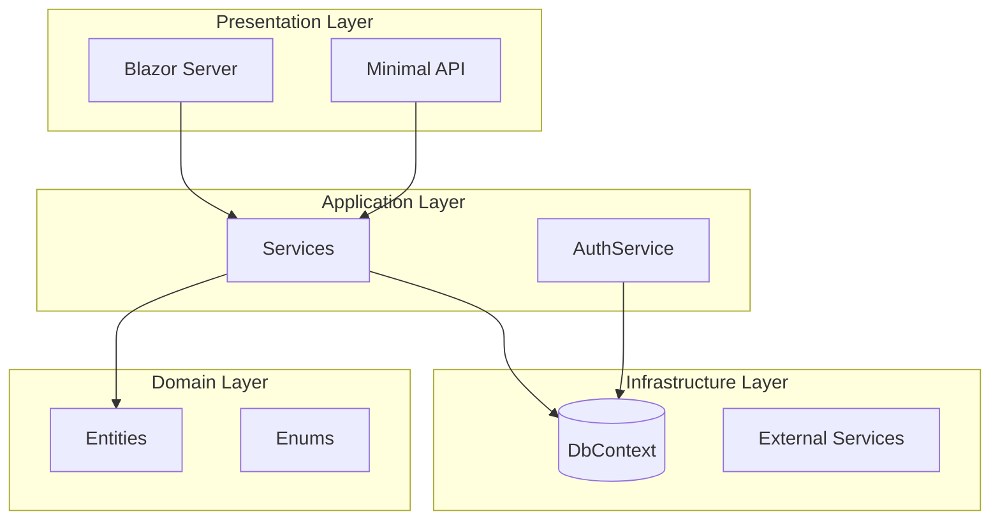
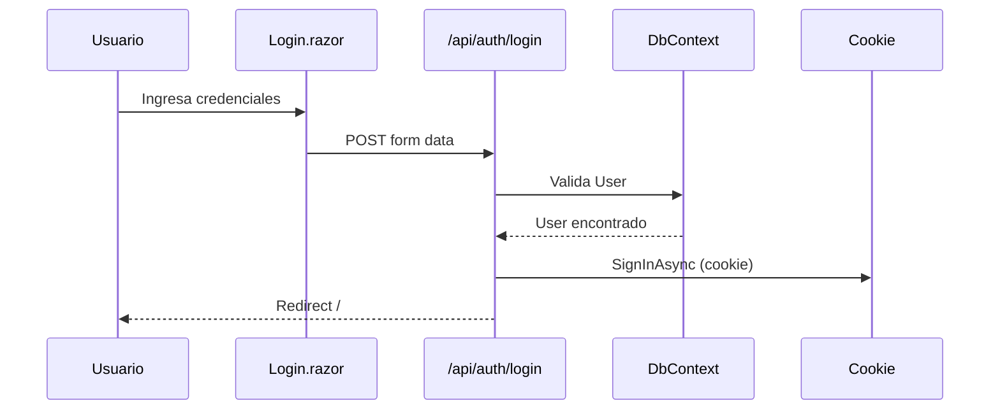
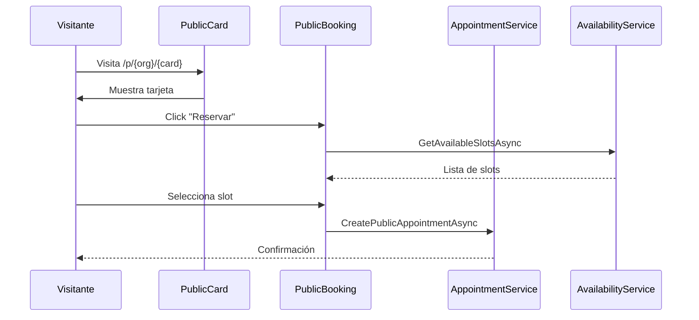
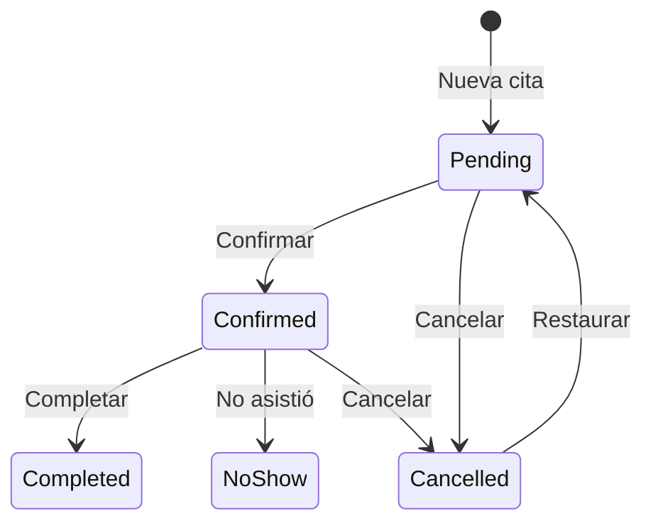
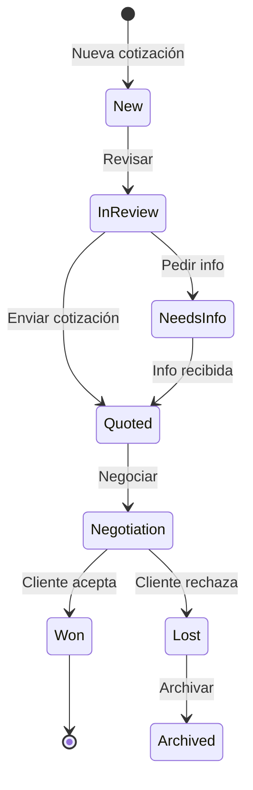
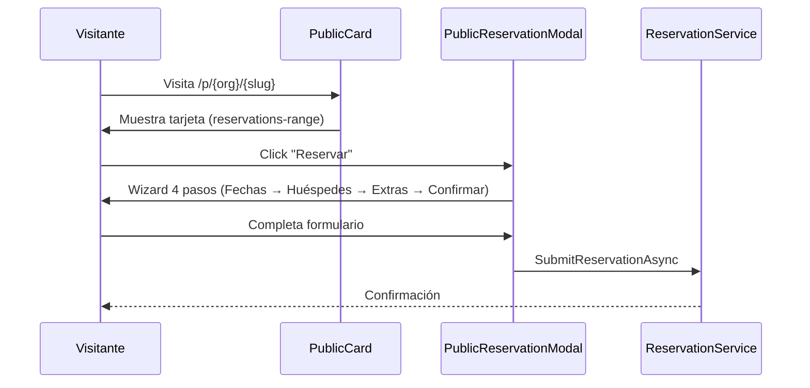
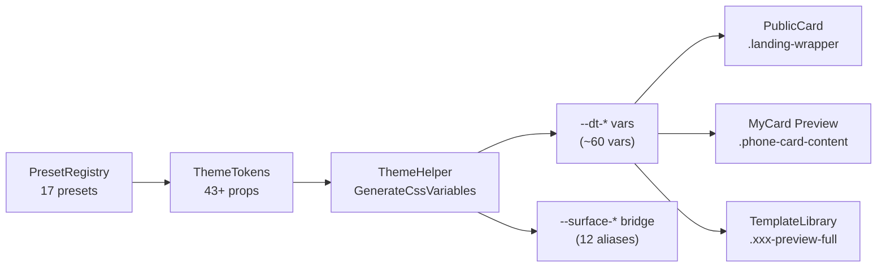

# 🏗️ ARCHITECTURE.md - Arquitectura del Sistema

## Diagrama de Capas

## Flujo de Autenticación

## Flujo de Booking

## Machine State: Appointments

## Machine State: Quotes

## Flujo de Reservaciones (Template 5)

## Pipeline de Theming (3 superficies)

## Decisiones Arquitectónicas

| Decisión | Razón | Fecha |
|----------|-------|-------|
| InMemory para desarrollo | Evitar dependencia de SQL Server | Dic 2025 |
| Cookie Auth vs JWT | Blazor Server maneja sesión | Dic 2025 |
| Services en Web, no Domain | Simplicidad para MVP | Ene 2026 |
| Background Service para SLA | Alertas automáticas | Ene 2026 |
| SemaphoreSlim en MyCard | Serializar DB ops, evitar EF Core concurrency crash | Feb 2026 |
| IDbContextFactory para dashboards | Contextos cortos para read-only queries | Feb 2026 |
| Schema updates via raw SQL (no EF Migrations) | Control explícito de ALTER TABLE | Feb 2026 |
| Static PresetRegistry (no DI/DB) | Presets inmutables, sin lifetime concerns | Feb 2026 |
| Dual CSS var namespace (--dt-* + --surface-*) | Migración gradual sin romper legacy | Feb 2026 |

---

*Última actualización: Febrero 2026*
