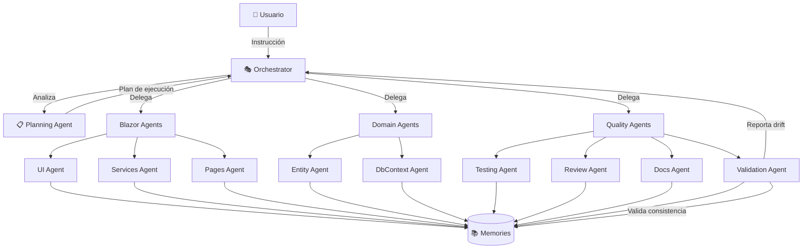

# 🤖 Arquitectura Multi-Agente para DataTouch CRM - v1.0

## Resumen Ejecutivo

Sistema de orquestación de agentes LLM especializados para acelerar el desarrollo del proyecto **DataTouch CRM**. Utiliza archivos `.md` como memoria compartida persistente, creando una "red neuronal centralizada" específica para esta plataforma de tarjetas digitales profesionales.

**Versión**: 1.0
**Score de Viabilidad**: 9/10 🌟
**Fecha**: Enero 2026
**Stack**: .NET 9.0, Blazor Server, MudBlazor, EF Core

---

## 📐 Análisis de Arquitectura Actual

### Blazor Server (DataTouch.Web)

| Aspecto | Patrón Actual | Patrón Ideal (Clean) |
|---------|---------------|----------------------|
| **Estructura** | Clean Architecture (3 capas) | ✅ Ya implementado |
| **Pages** | Componentes muy grandes (5000+ líneas) | Componentes < 500 líneas |
| **Services** | Lógica encapsulada (13 servicios) | ✅ Ya implementado |
| **DbContext** | EF Core directo | Repository pattern |
| **DTOs** | Definidos inline en servicios | Carpeta Models/ separada |
| **Validación** | Manual en componentes | FluentValidation |

**Diagnóstico**: Clean Architecture básica implementada. Oportunidad de refactorizar páginas grandes.

**Archivos críticos identificados**:

| Archivo | Líneas | Problema |
|---------|--------|----------|
| `MyCard.razor` | 5275 | Componente monolítico, mezcla UI/lógica |
| `PublicCard.razor` | 2501 | Lógica de temas y CTAs mezclada |
| `Appointments.razor` | 1683 | Múltiples tabs en un archivo |
| `DashboardService.cs` | 1010 | Demasiados métodos (37) |
| `Dashboard.razor` | 1200+ | Muchos gráficos inline |

---

### Capa de Dominio (DataTouch.Domain)

| Aspecto | Patrón Actual | Patrón Ideal |
|---------|---------------|--------------|
| **Entidades** | 16 entidades POC | ✅ Bien estructurado |
| **Enums** | En archivos de entidad | Archivo separado |
| **Value Objects** | No existen | Agregar para Phone, Email |
| **Domain Events** | No existen | Para notificaciones |

---

### Capa de Infraestructura (DataTouch.Infrastructure)

| Aspecto | Patrón Actual | Patrón Ideal |
|---------|---------------|--------------|
| **DbContext** | 385 líneas, bien configurado | ✅ Correcto |
| **Repositories** | No existen (EF directo) | Agregar interfaces |
| **External Services** | No separados | Abstraer integraciones |

---

## 🧠 Arquitectura del Sistema Multi-Agente

### Diagrama Principal (Mermaid)



### Diagrama ASCII (Alternativo)

```
┌─────────────────────────────────────────────────────────────────────────────┐
│                          🎭 ORCHESTRATOR AGENT                               │
│  • Recibe instrucciones del usuario                                         │
│  • Coordina agentes (NO analiza tareas complejas)                           │
│  • Maneja locks de archivos                                                 │
│  • Valida completitud                                                       │
└─────────────────────────────────────────────────────────────────────────────┘
                                  │
                                  ▼
┌─────────────────────────────────────────────────────────────────────────────┐
│                          📋 PLANNING AGENT                                   │
│  • Analiza y descompone tareas complejas                                    │
│  • Identifica dependencias entre subtareas                                  │
│  • Estima esfuerzo por subtarea                                             │
│  • Crea plan de ejecución ordenado                                          │
└─────────────────────────────────────────────────────────────────────────────┘
                                  │
         ┌────────────────────────┼────────────────────────┐
         │                        │                        │
         ▼                        ▼                        ▼
┌─────────────────────┐  ┌─────────────────────┐  ┌─────────────────────┐
│   BLAZOR AGENTS     │  │   DOMAIN AGENTS     │  │   QUALITY AGENTS    │
│   (3 agentes)       │  │   (2 agentes)       │  │   (4 agentes)       │
│                     │  │                     │  │                     │
│  • UI Agent         │  │  • Entity Agent     │  │  • Testing Agent    │
│  • Services Agent   │  │  • DbContext Agent  │  │  • Review Agent     │
│  • Pages Agent      │  │                     │  │  • Docs Agent       │
│                     │  │                     │  │  • Validation Agent │
└─────────────────────┘  └─────────────────────┘  └─────────────────────┘
         │                        │                        │
         └────────────────────────┼────────────────────────┘
                                  │
                                  ▼
┌─────────────────────────────────────────────────────────────────────────────┐
│                         📚 MEMORIA COMPARTIDA                                │
│  Archivos .md versionados en Git, accesibles por todos los agentes          │
│  Ubicación: /memories                                                        │
└─────────────────────────────────────────────────────────────────────────────┘
```

---

## 👥 Inventario Completo de Agentes

### Total: 11 Agentes

#### Agentes de Coordinación (2)

| # | Agente | Responsabilidad | Input | Output |
|---|--------|-----------------|-------|--------|
| 1 | **Orchestrator** | Coordinación, delegación, locks | Instrucción usuario | Tareas delegadas |
| 2 | **Planning Agent** | Análisis complejo, descomposición | Tarea compleja | Plan de ejecución |

#### Blazor Agents (3)

| # | Agente | Responsabilidad | Archivos que Modifica |
|---|--------|-----------------|----------------------|
| 3 | **UI Agent** | Componentes Shared, layouts, estilos | `Components/Shared/`, `Components/Layout/` |
| 4 | **Services Agent** | Servicios de negocio, DTOs | `Services/`, `Models/` |
| 5 | **Pages Agent** | Páginas Razor, routing | `Components/Pages/` |

#### Domain Agents (2)

| # | Agente | Responsabilidad | Archivos que Modifica |
|---|--------|-----------------|----------------------|
| 6 | **Entity Agent** | Entidades, enums, value objects | `Domain/Entities/` |
| 7 | **DbContext Agent** | Configuración EF, migraciones | `Infrastructure/Data/`, `sql/migrations/` |

#### Quality Agents (4)

| # | Agente | Responsabilidad | Output |
|---|--------|-----------------|--------|
| 8 | **Testing Agent** | Unit tests, integration tests | `tests/DataTouch.Tests/` |
| 9 | **Review Agent** | Code quality, best practices | `REVIEW.md`, comentarios |
| 10 | **Docs Agent** | Documentación técnica | `CLAUDE.md`, `docs/` |
| 11 | **Validation Agent** | Consistencia memorias vs código | `VALIDATION_REPORT.md` |

---

## 📁 Estructura de Memorias

```
/DataTouch
├── /memories                           # Directorio principal
│   │
│   ├── CONTEXT.md                      # Resumen ejecutivo del proyecto
│   ├── STANDARDS.md                    # Convenciones + límites de complejidad
│   ├── ARCHITECTURE.md                 # Diagramas Mermaid + decisiones
│   ├── CURRENT_SPRINT.md               # Tareas + tabla de locks de archivos
│   ├── DECISIONS_LOG.md                # Historial de decisiones técnicas
│   ├── TECH_DEBT.md                    # Deuda técnica priorizada
│   ├── ANTI_PATTERNS.md                # Patrones a evitar (detectados)
│   ├── LEARNINGS.md                    # Lecciones aprendidas
│   │
│   ├── /blazor
│   │   ├── PAGES.md                    # Catálogo de páginas
│   │   ├── COMPONENTS.md               # Componentes compartidos
│   │   ├── SERVICES.md                 # Servicios y métodos
│   │   └── ROUTING.md                  # Mapa de rutas
│   │
│   ├── /domain
│   │   ├── ENTITIES.md                 # Entidades y relaciones
│   │   ├── ENUMS.md                    # Estados y tipos
│   │   └── DBCONTEXT.md                # Configuración EF Core
│   │
│   ├── /agents                         # Instrucciones por agente
│   │   ├── ORCHESTRATOR.md
│   │   ├── PLANNING.md
│   │   ├── VALIDATION.md
│   │   ├── BLAZOR_UI.md
│   │   ├── BLAZOR_SERVICES.md
│   │   ├── BLAZOR_PAGES.md
│   │   ├── DOMAIN_ENTITY.md
│   │   ├── DOMAIN_DBCONTEXT.md
│   │   ├── TESTING.md
│   │   ├── REVIEW_CHECKLIST.md
│   │   └── DOCS.md
│   │
│   └── /reports                        # Reportes generados
│       ├── VALIDATION_REPORT.md
│       └── COST_REPORT.md
│
├── /scripts                            # Scripts de automatización
│   ├── init-memories.ps1               # Inicializa memorias desde código
│   ├── validate-memories.ps1           # Valida consistencia
│   └── run-agent.ps1                   # Ejecuta un agente específico
│
├── /src
│   ├── /DataTouch.Domain
│   ├── /DataTouch.Infrastructure
│   ├── /DataTouch.Web
│   └── /DataTouch.Api
│
└── /tests
    └── /DataTouch.Tests
```

---

## 🔒 Manejo de Conflictos

### Sistema de Locks

Cada agente debe registrar archivos que va a modificar. El Orchestrator mantiene una tabla en `CURRENT_SPRINT.md`:

```markdown
## 🔒 Tabla de Locks Activos

| Archivo | Agente | Inicio | Timeout |
|---------|--------|--------|---------|
| `MyCard.razor` | Pages Agent | 14:30:00 | 14:45:00 |
| `AppointmentService.cs` | Services Agent | 14:32:00 | 14:47:00 |
| `Card.cs` | Entity Agent | 14:30:00 | 14:50:00 |
```

### Reglas de Lock

1. **Antes de modificar**: Agente solicita lock al Orchestrator
2. **Conflicto detectado**: Orchestrator pone en cola al segundo agente
3. **Timeout**: Si agente no libera en 15 min, Orchestrator fuerza liberación
4. **Dependencia circular**: Planning Agent debe reordenar tareas

---

## 💰 Estimación de Costos

### Por Feature Mediana (ej: agregar campo a servicio)

| Agente | Tokens Input | Tokens Output | Costo Estimado |
|--------|-------------|---------------|----------------|
| Orchestrator | 3K | 1K | $0.06 |
| Planning Agent | 5K | 2K | $0.11 |
| Entity Agent | 8K | 4K | $0.20 |
| DbContext Agent | 6K | 3K | $0.15 |
| Services Agent | 10K | 5K | $0.25 |
| Pages Agent | 12K | 6K | $0.30 |
| Testing Agent | 8K | 10K | $0.38 |
| Validation Agent | 5K | 2K | $0.11 |
| **Total** | **57K** | **33K** | **~$1.56** |

### Proyección Mensual

| Escenario | Features/Sprint | Costo/Sprint | Costo/Mes |
|-----------|-----------------|--------------|-----------|
| Conservador | 3 | $5 | $10 |
| Normal | 5 | $8 | $16 |
| Intensivo | 10 | $16 | $32 |

---

## ⚠️ Riesgos y Mitigaciones

### 1. Hallucinations en Cadena 🔴 CRÍTICO

**Problema**: Si un agente alucina (ej: crea propiedad inexistente), los siguientes construyen sobre esa alucinación.

**Mitigación**:
```markdown
## Validación Obligatoria por Agente

Antes de reportar "completado", cada agente DEBE:
1. ✅ Verificar que todos los using/imports existen
2. ✅ Validar contra memories/domain/ENTITIES.md
3. ✅ Ejecutar dotnet build (no solo simular)
4. ✅ Confirmar que archivos referenciados existen
5. ✅ Si crea propiedad, verificar que entidad existe
```

### 2. Blazor Pages Muy Grandes 🟡 MEDIO

**Problema**: MyCard.razor tiene 5275 líneas, difícil de modificar parcialmente.

**Mitigación**:
- Extraer secciones a componentes antes de modificar
- Pages Agent debe proponer split si detecta > 1000 líneas
- Crear componentes reutilizables en /Shared

### 3. Drift Código vs Memorias 🟡 MEDIO

**Problema**: Cambios manuales no actualizan memorias.

**Mitigación**:
- Validation Agent ejecuta al final de cada sprint
- Script auto-genera partes de memorias (entidades, servicios)

---

## 🚦 Límites de Complejidad

Agregar a `memories/STANDARDS.md`:

### Blazor (.razor)

| Elemento | Máximo | Si excede... |
|----------|--------|--------------|
| **Página** | 800 líneas | Extraer a componentes |
| **Componente** | 300 líneas | Split en subcomponents |
| **Métodos en @code** | 10 | Crear service |
| **Parámetros [Parameter]** | 5 | Crear ViewModel |
| **Niveles de if/foreach** | 3 | Extraer a método |

### C# Services

| Elemento | Máximo | Si excede... |
|----------|--------|--------------|
| **Service** | 500 líneas | Split por responsabilidad |
| **Métodos por service** | 15 | Crear sub-services |
| **Parámetros por método** | 5 | Crear DTO |
| **Complejidad ciclomática** | 10 | Refactorizar |

---

## ❌ Anti-Patterns Detectados

Crear `memories/ANTI_PATTERNS.md`:

### Blazor

#### 1. Mega-Razor Files
```razor
@* ❌ MAL: MyCard.razor (5275 líneas) *@
@* Todo en un solo archivo *@

@* ✅ BIEN: Extraer secciones *@
<AppearanceSection @bind-Style="_style" />
<IdentitySection @bind-Card="_card" />
<ContactSection @bind-Card="_card" />
```

#### 2. Lógica en @code
```razor
@* ❌ MAL: Queries directas en página *@
@code {
    var appointments = await DbContext.Appointments
        .Where(a => a.CardId == cardId)
        .ToListAsync();
}

@* ✅ BIEN: Usar servicio *@
@code {
    var appointments = await AppointmentService.GetByCardAsync(cardId);
}
```

#### 3. State en páginas
```razor
@* ❌ MAL: 50+ variables privadas en @code *@

@* ✅ BIEN: ViewModel pattern *@
private MyCardViewModel _vm = new();
```

### C# Services

#### 1. God Service
```csharp
// ❌ MAL: DashboardService.cs (1010 líneas, 37 métodos)

// ✅ BIEN: Split por responsabilidad
KpiService, ChartService, InsightsService
```

#### 2. DTOs Inline
```csharp
// ❌ MAL: DTOs definidos al final del service

// ✅ BIEN: Carpeta Models/ separada
```

---

## 🔧 Stack Técnico Recomendado

### Opción 1: CrewAI (⭐ RECOMENDADA)

```python
from crewai import Agent, Task, Crew

# Definir agentes
orchestrator = Agent(
    role='Orchestrator',
    goal='Coordinar agentes especializados para DataTouch CRM',
    backstory=open('memories/agents/ORCHESTRATOR.md').read(),
    memory=True,
    verbose=True
)

planning_agent = Agent(
    role='Planning Agent',
    goal='Descomponer tareas complejas en subtareas ejecutables',
    backstory=open('memories/agents/PLANNING.md').read(),
    memory=True
)

blazor_services = Agent(
    role='Blazor Services Expert',
    goal='Implementar servicios y lógica de negocio en C#',
    backstory=open('memories/agents/BLAZOR_SERVICES.md').read(),
    memory=True,
    tools=[FileWriteTool(), FileReadTool()]
)

# Crear crew
crew = Crew(
    agents=[orchestrator, planning_agent, blazor_services, ...],
    tasks=[],
    memory=True,
    verbose=True,
    process=Process.hierarchical,
    manager_agent=orchestrator
)

# Ejecutar
result = crew.kickoff(inputs={
    'task': 'Agregar sistema de notificaciones por email'
})
```

### Opción 2: Custom (Python + Claude API)

```python
import anthropic
from pathlib import Path

class Agent:
    def __init__(self, name: str, memories_path: str):
        self.name = name
        self.client = anthropic.Client()
        self.instructions = Path(f"memories/agents/{name}.md").read_text()
        self.context = Path("memories/CONTEXT.md").read_text()
    
    def execute(self, task: str) -> str:
        response = self.client.messages.create(
            model="claude-sonnet-4-20250514",
            max_tokens=4096,
            system=f"{self.instructions}\n\nContexto del proyecto:\n{self.context}",
            messages=[{"role": "user", "content": task}]
        )
        return response.content[0].text

class Orchestrator:
    def __init__(self):
        self.agents = {
            'planning': Agent('PLANNING', 'memories/agents/'),
            'blazor_services': Agent('BLAZOR_SERVICES', 'memories/agents/'),
            'entity': Agent('DOMAIN_ENTITY', 'memories/agents/'),
            # ...
        }
        self.locks = {}
    
    def run(self, user_task: str):
        # 1. Planning
        plan = self.agents['planning'].execute(user_task)
        
        # 2. Execute subtasks
        for subtask in parse_plan(plan):
            agent = self.select_agent(subtask)
            result = agent.execute(subtask)
            self.update_memories(result)
        
        # 3. Validate
        validation = self.agents['validation'].execute("Validar cambios")
        
        return validation
```

---

## 🔀 GitFlow y Estrategia de Rollback

### Flujo de Branches para Agentes

```
main ─────────────────────────────────────────────────────────────────►
  │
  └── develop ────────────────────────────────────────────────────────►
         │
         │  ANTES de cada sesión de agentes:
         │  1. git checkout develop
         │  2. git checkout -b agent/task-name-YYYYMMDD-HHMM
         │  3. Snapshot automático de /memories
         │
         └── agent/add-notifications-20260120-1900 ──┐
                 │                                    │
                 │ Agentes trabajan aquí              │
                 │ (commits atómicos)                 │
                 │                                    │
                 ▼                                    │
            ┌─────────────┐                           │
            │ ¿Validación │                           │
            │   pasó?     │                           │
            └──────┬──────┘                           │
                   │                                  │
         ┌─────────┴─────────┐                        │
         ▼                   ▼                        │
    ✅ Merge a          ❌ Rollback                   │
    develop             git reset --hard ◄────────────┘
```

### Convención de Commits

```
agent(planning): descomponer tarea en 5 subtareas
agent(entity): agregar campo NotificationPreferences a User
agent(dbcontext): actualizar configuración User
agent(services): crear NotificationService
agent(pages): agregar toggle de notificaciones en MyCard
agent(testing): agregar tests para NotificationService
agent(validation): validar consistencia memorias
```

---

## 🚀 Roadmap de Implementación

### Fase 0: Pre-Setup (Medio día)

```powershell
# Crear script de inicialización
./scripts/init-memories.ps1

# Este script:
# 1. Escanea código actual (entidades, servicios, páginas)
# 2. Auto-genera memories base
# 3. Detecta deuda técnica
# 4. Crea CONTEXT.md inicial
```

### Fase 1: Setup Base (1 día)

- [ ] Crear estructura `/memories`
- [ ] Crear CONTEXT.md (basado en CLAUDE.md existente)
- [ ] Crear STANDARDS.md con convenciones + límites
- [ ] Crear ARCHITECTURE.md con diagramas Mermaid
- [ ] Crear script `validate-memories.ps1`

### Fase 2: Memorias de Dominio (1 día)

- [ ] Crear memories/domain/ENTITIES.md (auto-generado)
- [ ] Crear memories/blazor/SERVICES.md (auto-generado)
- [ ] Crear memories/blazor/PAGES.md
- [ ] Crear ANTI_PATTERNS.md

### Fase 3: Instrucciones de Agentes (1 día)

- [ ] Crear prompts para los 11 agentes
- [ ] Definir reglas de comunicación
- [ ] Crear sistema de locks
- [ ] Crear Validation Agent

### Fase 4: Prueba Piloto (2 días)

**Feature seleccionada**: Extraer secciones de MyCard.razor a componentes

- [ ] Ejecutar flujo completo con agentes
- [ ] Medir: tiempo, tokens, calidad, bugs
- [ ] Documentar problemas en LEARNINGS.md

### Fase 5: Iteración (1 día)

- [ ] Ajustar prompts según resultados piloto
- [ ] Optimizar flujo de agentes
- [ ] Reducir costos de tokens innecesarios

---

## 📊 Casos de Uso

### ✅ Ideal Para

| Caso de Uso | Beneficio | Ejemplo DataTouch |
|-------------|-----------|-------------------|
| **Refactorings grandes** | Consistencia garantizada | Split MyCard.razor en componentes |
| **Features complejas** | Paralelización | Sistema de notificaciones email |
| **Generación de tests** | Velocidad | Cobertura del 0% → 60% |
| **Documentación** | Actualización automática | Mantener CLAUDE.md al día |
| **Nueva entidad** | Full stack | Agregar Subscription entity |

### ❌ No Ideal Para

| Caso de Uso | Razón |
|-------------|-------|
| **Bugs urgentes** | Overhead de orquestación es lento |
| **Cambios triviales** | Un typo no necesita 5 agentes |
| **Debugging interactivo** | Agentes no "piensan en tiempo real" |
| **Decisiones de diseño** | Humanos deben decidir arquitectura |

---

## 📝 Scripts de Automatización (PowerShell)

### `scripts/init-memories.ps1`

```powershell
# Inicializa memorias desde código existente
Write-Host "🔍 Escaneando proyecto DataTouch..." -ForegroundColor Cyan

# Crear estructura
New-Item -Path "memories/blazor", "memories/domain", "memories/agents", "memories/reports" -ItemType Directory -Force

# Auto-generar ENTITIES.md
Write-Host "📦 Generando ENTITIES.md..." -ForegroundColor Yellow
$entities = Get-ChildItem "src/DataTouch.Domain/Entities/*.cs" | ForEach-Object { $_.BaseName }
$content = "# Entidades del Dominio`n`n"
foreach ($entity in $entities) {
    $content += "## $entity`n`n"
}
$content | Out-File "memories/domain/ENTITIES.md"

# Auto-generar SERVICES.md
Write-Host "⚙️ Generando SERVICES.md..." -ForegroundColor Yellow
$services = Get-ChildItem "src/DataTouch.Web/Services/*.cs" | ForEach-Object { $_.BaseName }
$content = "# Servicios de la Aplicación`n`n"
foreach ($service in $services) {
    $content += "## $service`n`n"
}
$content | Out-File "memories/blazor/SERVICES.md"

# Auto-generar PAGES.md
Write-Host "📄 Generando PAGES.md..." -ForegroundColor Yellow
$pages = Get-ChildItem "src/DataTouch.Web/Components/Pages/*.razor" | ForEach-Object { 
    @{
        Name = $_.BaseName
        Lines = (Get-Content $_.FullName | Measure-Object -Line).Lines
    }
}
$content = "# Páginas Blazor`n`n| Página | Líneas |`n|--------|--------|`n"
foreach ($page in $pages) {
    $content += "| $($page.Name) | $($page.Lines) |`n"
}
$content | Out-File "memories/blazor/PAGES.md"

Write-Host "✅ Memorias inicializadas" -ForegroundColor Green
```

### `scripts/validate-memories.ps1`

```powershell
# Valida consistencia entre memorias y código
Write-Host "🔍 Validando memorias..." -ForegroundColor Cyan

$errors = @()

# Verificar que entidades en ENTITIES.md existen
$memorizedEntities = Get-Content "memories/domain/ENTITIES.md" | Select-String "^## " | ForEach-Object { $_.Line -replace "## ", "" }
foreach ($entity in $memorizedEntities) {
    if (-not (Test-Path "src/DataTouch.Domain/Entities/$entity.cs")) {
        $errors += "❌ Entidad $entity no existe en código"
    }
}

# Verificar servicios
$memorizedServices = Get-Content "memories/blazor/SERVICES.md" | Select-String "^## " | ForEach-Object { $_.Line -replace "## ", "" }
foreach ($service in $memorizedServices) {
    if (-not (Test-Path "src/DataTouch.Web/Services/$service.cs")) {
        $errors += "❌ Servicio $service no existe en código"
    }
}

if ($errors.Count -eq 0) {
    Write-Host "✅ Validación completada sin errores" -ForegroundColor Green
} else {
    Write-Host "⚠️ Errores encontrados:" -ForegroundColor Red
    $errors | ForEach-Object { Write-Host $_ -ForegroundColor Red }
}
```

---

## 🎯 Recomendación Final

### Para Comenzar (Próxima Semana)

1. **Implementar versión mínima con 5 agentes**:
   - Orchestrator
   - Planning Agent
   - Blazor Agent (unificado)
   - Domain Agent (unificado)
   - Validation Agent

2. **Prueba piloto en feature real**:
   - "Extraer AppearanceSection de MyCard.razor a componente separado"
   - Medir: tiempo, calidad, bugs, tokens

3. **Si funciona, expandir a 8 agentes**:
   - Separar Blazor en UI/Services/Pages
   - Agregar Testing Agent

4. **Luego los 11 agentes completos**

### Próximos Pasos Inmediatos

1. [ ] Crear `/memories` con estructura base
2. [ ] Ejecutar `init-memories.ps1` para auto-generar
3. [ ] Escribir prompt del Orchestrator
4. [ ] Hacer prueba piloto con AppearanceSection
5. [ ] Documentar resultados en LEARNINGS.md

---

*Documento creado: Enero 2026*
*Versión: 1.0 (Adaptado para DataTouch CRM)*
*Próxima revisión: Después de prueba piloto*
